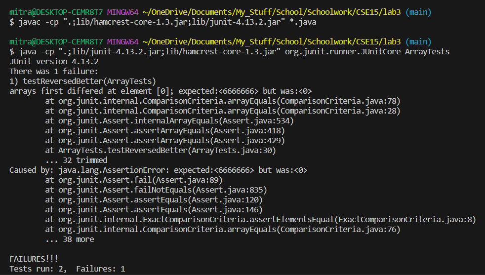
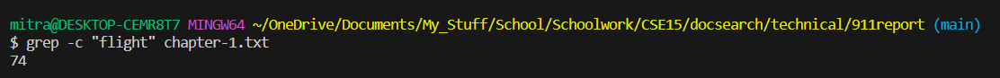
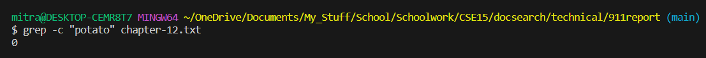
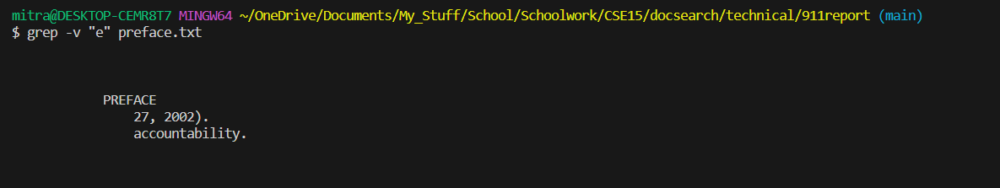
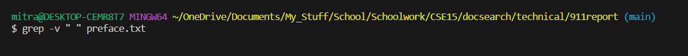
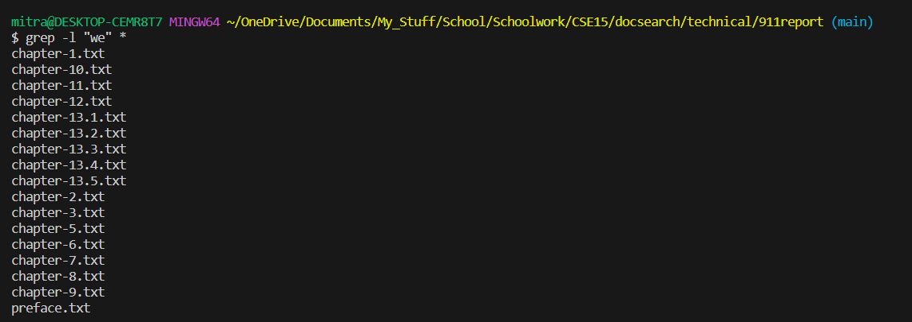
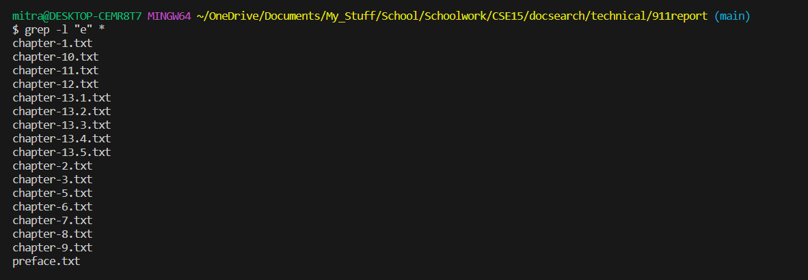
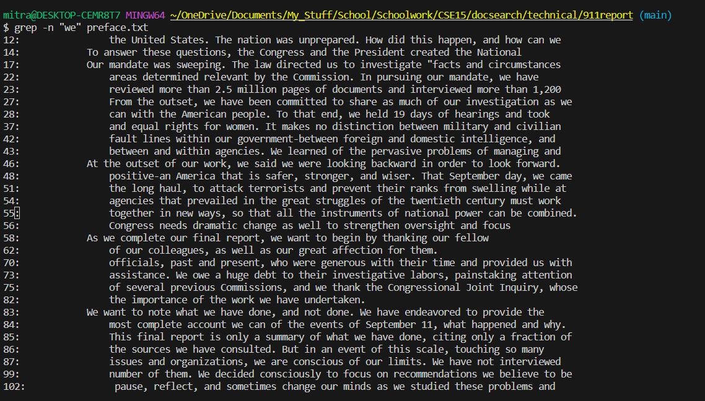
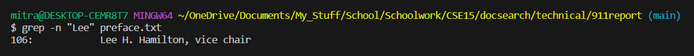

**Bug Chosen**
```
// Returns a *new* array with all the elements of the input array in reversed
  // order
  static int[] reversed(int[] arr) {
    int[] newArray = new int[arr.length];
    for(int i = 0; i < arr.length; i += 1) {
      arr[i] = newArray[arr.length - i - 1];
    }
    return arr;
  }
```
**Bug With Failing Test**
```
@Test
  public void testReversedBetter() {
    int[] input1 = { 6, 666, 6666666 };
    assertArrayEquals(new int[]{ 6666666, 666, 6}, ArrayExamples.reversed(input1));
  }
```
**Bug With Passing Test**
```
@Test
  public void testReversed() {
    int[] input1 = { };
    assertArrayEquals(new int[]{ }, ArrayExamples.reversed(input1));
  }
```
**Associated Code**
```
javac -cp ".;lib/hamcrest-core-1.3.jar;lib/junit-4.13.2.jar" *.java
java -cp ".;lib/junit-4.13.2.jar;lib/hamcrest-core-1.3.jar" org.junit.runner.JUnitCore ArrayTests
```
**Symptom**

**Bug Fixed**
```
// Returns a *new* array with all the elements of the input array in reversed
  // order
  static int[] reversed(int[] arr) {
    int[] newArray = new int[arr.length];
    for(int i = 0; i < arr.length; i += 1) {
      newArray[i] = arr[arr.length - i - 1];
    }
    return newArray;
  }
```
**Why this works**

testReversed is broken because the newArray is never actually modified, so the method just changes all the values of the initial array to 0. This fix works because newArray is modified to be the actual reversal instead of just sitting there, and newArray is returned as the correct output. 

**grep commands:** all information below found from https://www.geeksforgeeks.org/grep-command-in-unixlinux/#

-c

grep -c "insert string here" textFile.txt



This command checks through all the lines in a text file, and displays the number of lines the input string is present in. It can be used as a worse version of ctrl-f, since it only counts lines and not the total number of times something appears. However, if you only need to know the number of lines something occurs in (for example, if some lines are "contaminated" by a string and you only need to know how many lines were affected), this is very useful. 

-v

grep -v "insert string here" textFile.txt



This command checks through all the lines in a text file, and displays the lines the input string is NOT present in. It can be used to weed out strings that contain strings you explicitly want to filter out. It can be used as a form of rudimentary censorship to possibly remove all the references to something but still have a legible output.

-l

grep -v "insert string here" *



This command checks through all the files in the current directory, and displays the text files that the input string is present in. This can be useful as the first stage of a sorting system, scanning entire directories instead of having to use grep on every individual text file to see if the input string is present or not. It can be very convenient to cross out entire text files in a quick way. 

-n

grep -n "insert string here" textFile.txt



This command checks through all the lines in a text file, then displays the lines the input string is present in AND provides the line numbers of those lines. This is useful as it is a fairly good version of ctrl-f, which unlike grep -c tells you exactly where the input string is present in the text files. This makes it easy to find the input strings in the text files themselves, since all you have to do is go to the line number(s) given.
